#  Repository di sviluppo

## per il sito web per la parrocchia e la CP di San Giorgio di Nogaro

**Siamo a conoscenza che utilizzare github per hostare il sito non è proprio professionale, stiamo lavorando per trasferirci a un dominio dedicato entro breve.**

## Struttura Tecnica del Progetto

### Architettura
Il sito è sviluppato come applicazione web statica utilizzando HTML5, CSS3 e JavaScript vanilla. L'architettura è basata su componenti modulari per facilitare la manutenzione e l'aggiornamento.

### Struttura delle Directory
```
CDGsite/
├── index.html          # Homepage principale
├── pages/             # Pagine secondarie del sito
│   ├── eventi.html    # Pagina degli eventi
│   └── privacy.html   # Informativa sulla privacy
├── static/            # Risorse statiche
│   ├── css/          # Fogli di stile
│   ├── js/           # Script JavaScript
│   │   └── components.js  # Componenti riutilizzabili
│   └── images/       # Immagini e media
```

### Tecnologie Utilizzate
- **Frontend**: HTML5, CSS3, JavaScript ES6+
- **Componenti**: Sistema di componenti modulari custom in JavaScript
- **Stile**: CSS personalizzato con design responsive
- **Hosting**: GitHub Pages (temporaneo)

### Caratteristiche Principali
- Design responsive per tutti i dispositivi
- Componenti riutilizzabili per header, footer e navigazione
- Ottimizzazione delle immagini per prestazioni migliori
- Sistema di routing client-side per la navigazione

### Sviluppo Locale
Per avviare il progetto in locale:
1. Clonare il repository
2. Aprire `index.html` in un browser moderno
3. Per lo sviluppo, si consiglia l'utilizzo di un server locale (es. Live Server)

### Roadmap
- [ ] Migrazione a un dominio dedicato
- [ ] Implementazione di un CMS per la gestione dei contenuti
- [ ] Ottimizzazione SEO
- [ ] Implementazione di analytics

```mermaid
%%{init: {
  'theme': 'dark',
  'themeVariables': {
    'fontSize': '16px',
    'fontFamily': 'arial',
    'lineWidth': '2px'
  }
}}%%

graph TD
    classDef mainServer fill:#2C3E50,stroke:#E74C3C,stroke-width:3px
    classDef google fill:#8E44AD,stroke:#9B59B6,stroke-width:3px
    classDef other fill:#2980B9,stroke:#3498DB,stroke-width:3px
    classDef mainNode fill:#34495E,stroke:#E74C3C,stroke-width:2px,color:#fff
    classDef linkNode fill:#34495E,stroke:#3498DB,stroke-width:2px,color:#fff

    subgraph MainServer["PAGINA CENTRALE CP"]
        A["cpsangiorgio.it"]:::mainNode
        B["Index"]:::mainNode
        C["Parrocchia 3<br/>(cpsangiorgio.it/par3)"]:::mainNode
        D["Parrocchia 4<br/>(cpsangiorgio.it/par4)"]:::mainNode
    end

    subgraph GoogleSite["GOOGLE SITE"]
        E["Parrocchia 1<br/>(sites.google.com/.../par1)"]:::linkNode
    end

    subgraph OtherServer["ALTRO SERVIZIO"]
        F["Parrocchia 2<br/>(dominio.par2.com)"]:::linkNode
    end

    %% Dynamic connections
    A ==>|"HA COME PAGINA PRINCIPALE"| B
    A ==>|"OSPITA"| C
    A ==>|"OSPITA"| D
    B -.->|"LINK INTERNO"| C
    B -.->|"LINK INTERNO"| D
    B -.->|"LINK ESTERNO"| E
    B -.->|"LINK ESTERNO"| F

    style MainServer fill:#2C3E50,stroke:#E74C3C,stroke-width:4px,color:#fff
    style GoogleSite fill:#8E44AD,stroke:#9B59B6,stroke-width:4px,color:#fff
    style OtherServer fill:#2980B9,stroke:#3498DB,stroke-width:4px,color:#fff
```


